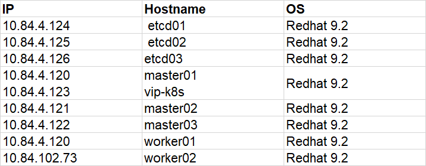
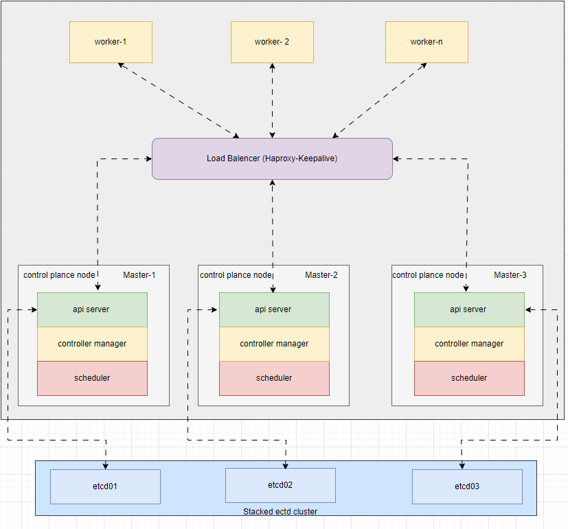

#### Topology

#### add hosts

    cat >> /etc/hosts << EOF
    10.84.4.124 etcd01
    10.84.4.125 etcd02
    10.84.4.126 etcd03
    10.84.4.120 master01
    10.84.4.121 master02
    10.84.4.122 master03
    10.84.4.120 worker01
    10.84.102.73 worker02
    10.84.4.123 vip-k8s
    EOF

#### install etcd nodes

    ETCD_RELEASE=$(curl -s https://api.github.com/repos/etcd-io/etcd/releases/latest|grep tag_name | cut -d '"' -f 4)
    echo $ETCD_RELEASE
    wget https://github.com/etcd-io/etcd/releases/download/${ETCD_RELEASE}/etcd-${ETCD_RELEASE}-linux-amd64.tar.gz
    tar xvf etcd-${ETCD_RELEASE}-linux-amd64.tar.gz
    cd etcd-${ETCD_RELEASE}-linux-amd64
    mv etcd* /usr/local/bin 
    ls /usr/local/bin
    etcd --version
    etcdctl version
    etcdutl version
    mkdir -p /var/lib/etcd

### On master01 node

#### install packages
    {
      wget -q --show-progress --https-only --timestamping \
      https://pkg.cfssl.org/R1.2/cfssl_linux-amd64 \
      https://pkg.cfssl.org/R1.2/cfssljson_linux-amd64
      
      chmod +x cfssl_linux-amd64 cfssljson_linux-amd64
      mv cfssl_linux-amd64 /usr/local/bin/cfssl
      mv cfssljson_linux-amd64 /usr/local/bin/cfssljson
    }
#### Create a Certificate Authority (CA)
    wget https://go.dev/dl/go1.21.6.linux-amd64.tar.gz
    sudo tar -C /usr/local -xzf go1.21.6.linux-amd64.tar.gz
    export PATH=$PATH:/usr/local/go/bin
    export GOPATH=$HOME/go
    source ~/.bash_profile; source ~/.bashrc;go version

    mkdir CA_ETCD; cd CA_ETCD

    curl -LO https://raw.githubusercontent.com/letran3691/K8S_Clusters/main/gent_cert.go
    go env -w GO111MODULE=auto
    go mod init root/CA_ETCD
    go mod tidy
    go run . 10.84.4.124 10.84.4.125 10.84.4.126

#### Copy the certificates to etcd nodes

    {
    declare -a NODES=(10.84.4.124 10.84.4.125 10.84.4.126)
    for node in ${NODES[@]}; do
      scp ca.pem etcd.pem etcd-key.pem root@$node: 
    done
    }

#### On all etcd nodes

    {
      mv ca.pem etcd.pem etcd-key.pem /var/lib/etcd/
      mkdir /etc/etcd
      mkdir /var/lib/etcd
    }

#### Create systemd unit file for etcd service on all etcd nodes

    {
    NODE_IP="10.84.4.124"
    
    ETCD_NAME=$(hostname -s)
    
    ETCD1_IP="10.84.4.124"
    ETCD2_IP="10.84.4.125"
    ETCD3_IP="10.84.4.126"

    cat <<EOF >/etc/etcd/etcd.conf
    ETCD_NAME=${ETCD_NAME}
    ETCD_INITIAL_ADVERTISE_PEER_URLS="https://${NODE_IP}:2380"
    ETCD_LISTEN_PEER_URLS="https://${NODE_IP}:2380"
    ETCD_LISTEN_CLIENT_URLS="https://${NODE_IP}:2379,https://127.0.0.1:2379"
    ETCD_ADVERTISE_CLIENT_URLS="https://${NODE_IP}:2379"
    ETCD_INITIAL_CLUSTER_TOKEN="etcd-cluster"
    ETCD_INITIAL_CLUSTER="etcd01=https://${ETCD1_IP}:2380,etcd02=https://${ETCD2_IP},etcd03=https://${ETCD3_IP}:2380"
    ETCD_LOG_OUTPUTS="/var/lib/etcd/etcd.log"
    ETCD_INITIAL_CLUSTER_STATE NEW
    ETCD_PEER_AUTO_TLS
    ETCD_SNAPSHOT_COUNT="10000"
    ETCD_WAL_DIR="/var/lib/etcd/wal"
    ETCD_CLIENT_CERT_AUTH
    ETCD_TRUSTED_CA_FILE="/var/lib/etcd/ca.pem"
    ETCD_CERT_FILE="/var/lib/etcd/etcd.pem"
    ETCD_KEY_FILE="/var/lib/etcd/etcd-key.pem"
    ETCD_PEER_CLIENT_CERT_AUTH=true
    ETCD_PEER_TRUSTED_CA_FILE="/var/lib/etcd/ca.pem"
    ETCD_PEER_KEY_FILE="/var/lib/etcd/etcd-key.pem"
    ETCD_PEER_CERT_FILE="/var/lib/etcd/etcd.pem"
    ETCD_DATA_DIR="/var/lib/etcd/data"
    
    EOF

    cat <<EOF >/etc/systemd/system/etcd.service
    [Unit]
    Description=etcd key-value store
    Documentation=https://github.com/etcd-io/etcd
    After=network.target
    
    [Service]
    Type=notify
    EnvironmentFile=/etc/etcd/etcd.conf
    ExecStart=/usr/local/bin/etcd
    Restart=always
    RestartSec=10s
    LimitNOFILE=40000
    
    [Install]
    WantedBy=multi-user.target
    
    EOF
    }
#### start etcd service on ectd nodes

    {
      systemctl daemon-reload
      systemctl enable --now etcd
    }
#### Verify Etcd cluster

    etcdctl \
      --cacert=/var/lib/etcd/ca.pem \
      --cert=/var/lib/etcd/etcd.pem \
      --key=/var/lib/etcd/etcd-key.pem \
      member list \
      -w=table

### On all master nodes

#### install on all master nodes

    yum install haproxy keepalived -y

#### on master01 config keepalive
Note: change IP and network interface name

    vi /etc/keepalived/check_apiserver.sh
    
    #!/bin/sh
    APISERVER_VIP=10.84.4.123
    APISERVER_DEST_PORT=6443
    
    errorExit() {
        echo "*** $*" 1>&2
        exit 1
    }
    
    curl --silent --max-time 2 --insecure https://localhost:${APISERVER_DEST_PORT}/ -o /dev/null || errorExit "Error GET https://localhost:${APISERVER_DEST_PORT}/"
    if ip addr | grep -q ${APISERVER_VIP}; then
        curl --silent --max-time 2 --insecure https://${APISERVER_VIP}:${APISERVER_DEST_PORT}/ -o /dev/null || errorExit "Error GET https://${APISERVER_VIP}:${APISERVER_DEST_PORT}/"
    fi

    chmod +x /etc/keepalived/check_apiserver.sh

    cp /etc/keepalived/keepalived.conf /etc/keepalived/keepalived.conf-org

        
    sh -c '> /etc/keepalived/keepalived.conf'
    vi /etc/keepalived/keepalived.conf
    
    ! /etc/keepalived/keepalived.conf
    ! Configuration File for keepalived
    global_defs {
        router_id LVS_DEVEL
    }
    vrrp_script check_apiserver {
      script "/etc/keepalived/check_apiserver.sh"
      interval 3
      weight -2
      fall 10
      rise 2
    }
    
    vrrp_instance VI_1 {
        state MASTER
        interface ens192
        virtual_router_id 151
        priority 255
        authentication {
            auth_type PASS
            auth_pass 8dasdsa8Aq@
        }
        virtual_ipaddress {
            10.84.4.123/24
        }
        track_script {
            check_apiserver
        }
    }

#### config haproxy

    cp /etc/haproxy/haproxy.cfg /etc/haproxy/haproxy.cfg-org

### Note: remove config forntend, backend for example

    vi /etc/haproxy/haproxy.cfg
    #---------------------------------------------------------------------
    # apiserver frontend which proxys to the masters
    #---------------------------------------------------------------------
    frontend apiserver
        bind *:8443
        mode tcp
        option tcplog
        default_backend apiserver
    #---------------------------------------------------------------------
    # round robin balancing for apiserver
    #---------------------------------------------------------------------
    backend apiserver
        option httpchk GET /healthz
        http-check expect status 200
        mode tcp
        option ssl-hello-chk
        balance     roundrobin
            server master01 10.84.4.120:6443 check
            server master02 10.84.4.121:6443 check
            server master03 10.84.4.122:6443 check
    #---------------------------------------------------------------------
    # round robin balancing for nodeports
    #---------------------------------------------------------------------
    frontend nodeport-frontend
      bind *:30000-32767
      mode tcp
      option tcplog
      timeout client 10s
      default_backend nodeport-backend
    
    backend nodeport-backend
      mode tcp
      timeout connect 10s
      timeout server 10s
      balance roundrobin
    
      server master01 10.84.4.120
      server master02 10.84.4.121
      server master03 10.84.4.122

#### copy config files haproxy and keepalive to master02 & 03 nodes
    for f in master02 master03; do scp /etc/keepalived/check_apiserver.sh /etc/keepalived/keepalived.conf root@$f:/etc/keepalived; scp /etc/haproxy/haproxy.cfg root@$f:/etc/haproxy; done

#### On master02 & 03

#### Note: Only two parameters of this file need to be changed for master-2 & 3 nodes. State will become SLAVE for master 2 and 3, priority will be 254 and 253 respectively.

    systemctl enable keepalived --now
    systemctl enable haproxy --now

    mkdir -vp /etcd/kubernetes/pki/etcd/

##### copy certs to all Master nodes

    {
    declare -a NODES=(10.84.4.120 10.84.4.121 10.84.4.122)
    
    for node in ${NODES[@]}; do
      scp ca.pem etcd.pem etcd-key.pem root@$node:
    done
    }
#### execute all master node
    {
      mv ca.pem etcd.pem etcd-key.pem /etcd/kubernetes/pki/etcd/
    }

#### config k8s cluster on master node
    {
    cert=$(kubeadm certs certificate-key)
    
    cat <<EOF > kubeadm-config.yml1
    apiVersion: kubeadm.k8s.io/v1beta3
    kind: InitConfiguration
    bootstrapTokens:
    - groups:
      - system:bootstrappers:kubeadm:default-node-token
      token: abcdef.0123456556abcdkd
      ttl: 24h0m0s
      usages:
      - signing
      - authentication
    
    certificateKey: $cert
    nodeRegistration:
      criSocket: unix:///var/run/containerd/containerd.sock
      imagePullPolicy: IfNotPresent
      taints: null
    ---
    apiVersion: kubeadm.k8s.io/v1beta3
    kind: ClusterConfiguration
    apiServer:
      timeoutForControlPlane: 4m0s
      certSANs:
        - "127.0.0.1"
    certificatesDir: /etc/kubernetes/pki
    clusterName: kubernetes
    controllerManager: {}
    dns: {}
    etcd:
      external:
        endpoints:
        - "https://10.84.4.124:2379"
        - "https://10.84.4.125:2379"
        - "https://10.84.4.126:2379"
        caFile: "/etcd/kubernetes/pki/etcd/ca.pem"
        certFile: "/etcd/kubernetes/pki/etcd/etcd.pem"
        keyFile: "/etcd/kubernetes/pki/etcd/etcd-key.pem"
    imageRepository: registry.k8s.io
    kubernetesVersion: 1.28.7
    controlPlaneEndpoint: "vip-k8s:8443"
    networking:
      dnsDomain: cluster.local
      serviceSubnet: 10.96.0.0/12
    scheduler: {}
    
    EOF
    }